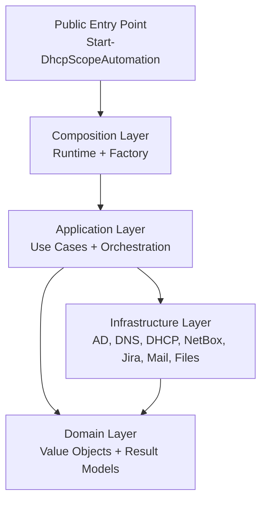
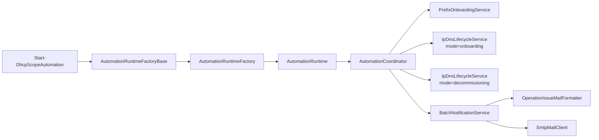
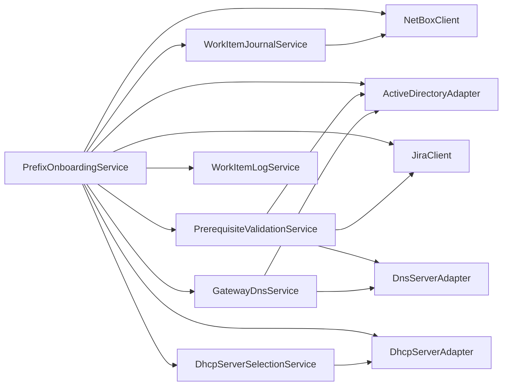
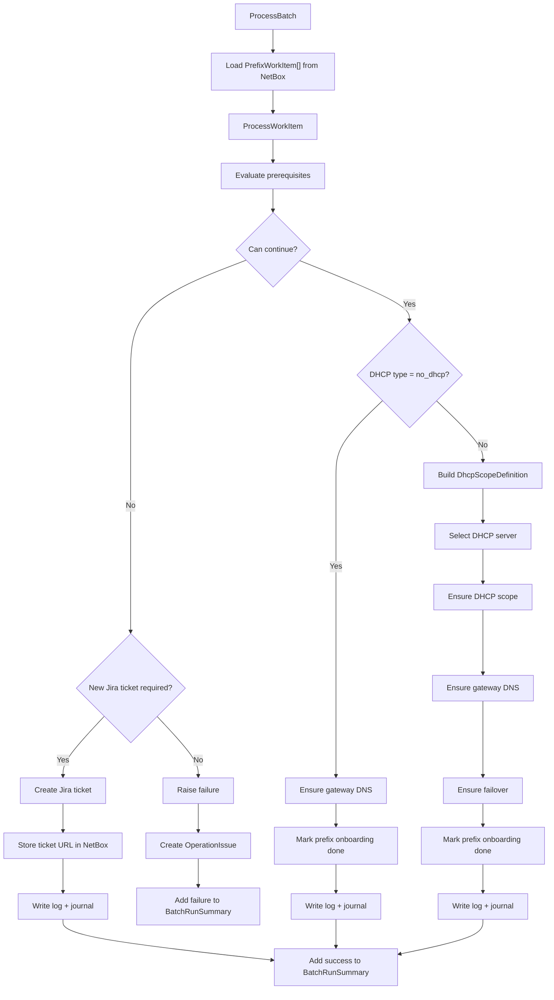
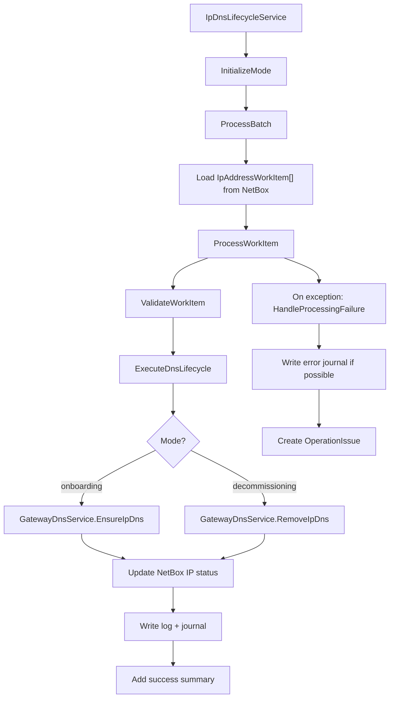
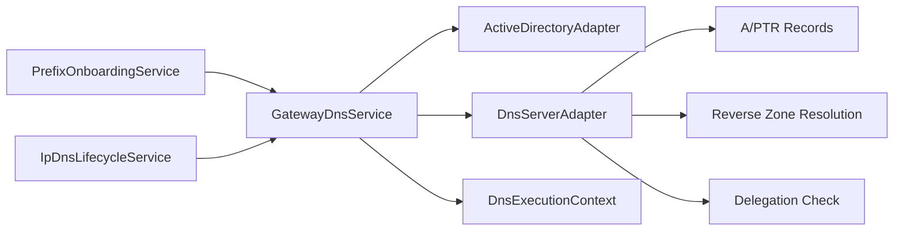
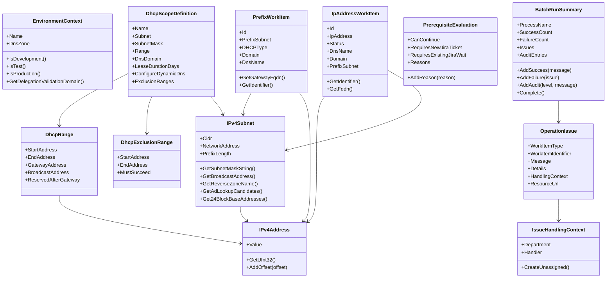
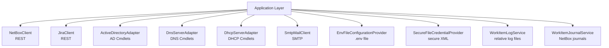

# Class Relationship Graphs

Dieses Dokument visualisiert die wichtigsten Beziehungen im Projekt
`DHCPScopeAutomation`, damit neue Entwickler schneller verstehen können,
welche Klassen welche Verantwortung tragen und wie die Use Cases aufgebaut sind.

## 1. Layer Overview

### Bedeutung

- `Public` enthält den Startpunkt des Moduls.
- `Composition` baut den Objektgraphen zusammen.
- `Application` enthält die fachlichen Workflows.
- `Domain` enthält die fachlichen Datenstrukturen.
- `Infrastructure` kapselt alle externen Systeme und PowerShell-Cmdlets.

## 2. Runtime Composition

### Bedeutung

- `AutomationRuntimeFactory` ist die Composition Root.
- `AutomationRuntime` hält die fertig aufgelöste Laufzeit.
- `AutomationCoordinator` ist die Fassade über alle aktivierten Use Cases.
- `IpDnsLifecycleService` wird zweimal mit unterschiedlichem Modus instanziiert.

## 3. Prefix Onboarding Dependencies

### Bedeutung

- `PrefixOnboardingService` ist der größte Orchestrator.
- Vorbedingungen werden separat über `PrerequisiteValidationService` geprüft.
- DHCP-Serverauswahl ist bewusst aus dem Onboarding-Service extrahiert.
- DNS für Gateway-Namen läuft über die Fassade `GatewayDnsService`.

## 4. Prefix Onboarding Flow

### Bedeutung

- Der Ablauf ist Template-Method-artig aufgebaut.
- Fachliche Verzweigungen sitzen in kleinen Methoden statt in einem Monolithen.
- Fehler werden immer in `OperationIssue` übersetzt.

## 5. IP DNS Lifecycle Flow

### Bedeutung

- Dieselbe Workflow-Hülle wird für zwei Lebenszyklus-Richtungen wiederverwendet.
- Der Modus bestimmt nur die DNS-Aktion und die Status-/Textvarianten.
- Dadurch bleibt die Logik wiederverwendbar und gut testbar.

## 6. DNS Facade and Adapter Boundary

### Bedeutung

- `GatewayDnsService` ist bewusst die Fassade zwischen Use Cases und DNS-Details.
- `DnsExecutionContext` verhindert wiederholte AD-/Reverse-Zonen-Auflösung.
- Die Use Cases kennen keine DNS-Cmdlets direkt.

## 7. Domain Model Overview

### Bedeutung

- `Domain` enthält fast nur Value Objects und Ergebnisobjekte.
- Diese Typen transportieren Fachlogik und Validierung.
- Sie kennen keine externen Systeme wie NetBox, DHCP oder Jira.

## 8. External System Adapters

### Bedeutung

- Alle externen Abhängigkeiten sind hinter dedizierten Adapterklassen versteckt.
- Dadurch bleibt die Application-Schicht mockbar und testbar.
- Für neue Systeme sollte dieselbe Struktur beibehalten werden.

## 9. What To Read First

Wenn du den Code verstehen willst, ist diese Reihenfolge sinnvoll:

1. [AutomationRuntimeFactory.ps1](/Users/juliusporzel/Development/AiTests/DHCPScopeAutomation/Classes/Composition/AutomationRuntimeFactory.ps1)
2. [AutomationCoordinator.ps1](/Users/juliusporzel/Development/AiTests/DHCPScopeAutomation/Classes/Application/AutomationCoordinator.ps1)
3. [PrefixOnboardingService.ps1](/Users/juliusporzel/Development/AiTests/DHCPScopeAutomation/Classes/Application/PrefixOnboardingService.ps1)
4. [IpDnsLifecycleService.ps1](/Users/juliusporzel/Development/AiTests/DHCPScopeAutomation/Classes/Application/IpDnsLifecycleService.ps1)
5. [GatewayDnsService.ps1](/Users/juliusporzel/Development/AiTests/DHCPScopeAutomation/Classes/Application/GatewayDnsService.ps1)
6. die Domain-Typen unter [Classes/Domain](/Users/juliusporzel/Development/AiTests/DHCPScopeAutomation/Classes/Domain)
7. die Adapter unter [Classes/Infrastructure](/Users/juliusporzel/Development/AiTests/DHCPScopeAutomation/Classes/Infrastructure)
